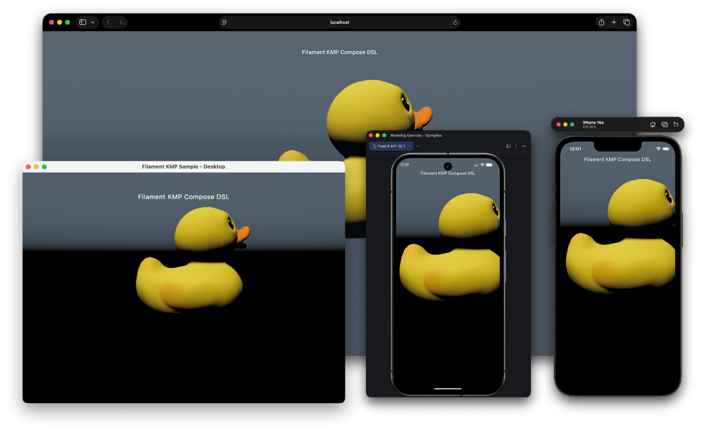

# Filament KMP

[](https://central.sonatype.com/namespace/io.github.erkko68.filament)
[](LICENSE)
[](https://github.com/google/filament)
[](https://kotlinlang.org/docs/multiplatform.html)
[](https://www.jetbrains.com/lp/compose-multiplatform/)

> [!NOTE]
> **Unofficial project.** This is a community-maintained Kotlin Multiplatform wrapper around [Google's Filament](https://github.com/google/filament). It is not affiliated with, endorsed by, or supported by Google or the Filament team.

> [!WARNING]
> **Pre-release (`0.1.2-beta`).** This is pre-1.0 software and public APIs may still change between releases — the JVM bindings were just rebuilt on Project Panama (FFM, **requires JDK 22+**) and the Web bindings on Karakum. Pin a specific version and read the [release notes](https://github.com/Erkko68/filament-kmp/releases) before upgrading.

**Filament KMP** brings the same physically based renderer that powers Android's Filament to **iOS**, **Desktop/JVM**, and **Web/WASM**, with first-class **Compose Multiplatform** integration.



```kotlin
FilamentView(
    modifier    = Modifier.fillMaxSize(),
    cameraState = rememberCameraState(eye = Position(0f, 1f, 4f)),
    skyboxState = rememberSkyboxState(SkyboxSource.Color(Color(0.1f, 0.12f, 0.15f))),
) {
    Light(type = LightManager.Type.DIRECTIONAL, intensity = 100_000f)
    GltfInstance(asset = rememberGltfAsset { Res.readBytes("files/Duck.glb") })
    Bloom(strength = 0.2f)
}
```

## Platform support

- **Android** — OpenGL ES / Vulkan via the official `com.google.android.filament` library
- **iOS** — Metal via C wrapper + Kotlin/Native cinterop
- **Desktop / JVM** (macOS, Windows, Linux) — Metal / Vulkan / OpenGL via Project Panama (FFM) bindings over a combined C wrapper
- **Web / WASM** — WebGL 2.0 via Filament.js, with Kotlin externals generated from `filament.d.ts` *(experimental)*

## Quick start

Add the Maven Central repository and depend on the modules you need:

```kotlin
// settings.gradle.kts
dependencyResolutionManagement {
    repositories {
        mavenCentral()
        google()
    }
}
```

```kotlin
// build.gradle.kts
kotlin {
    sourceSets {
        commonMain.dependencies {
            implementation("io.github.erkko68.filament:filament-compose:0.1.2-beta01")
        }
    }
}
```

For the full setup (Compose Multiplatform plugin, FFM native runtime for Desktop, iOS framework linking, Web prebuilts) see **[Getting Started](docs/getting-started.md)**.

## Modules

| Artifact | Description |
| :--- | :--- |
| `filament` | Core renderer — `Engine`, `Scene`, `View`, `Renderer`, `Camera`, `Texture`, `Material`. |
| `filament-compose` | Compose Multiplatform integration — `FilamentView`, scene DSL, camera state, post-processing. |
| `gltfio` | glTF / GLB asset loading — `AssetLoader`, `FilamentAsset`, `Animator`. |
| `filamat` | Runtime material compilation — `MaterialBuilder`. |
| `filament-utils` | Camera manipulators, HDR/KTX loaders, math helpers. |

All published under `io.github.erkko68.filament`. The Desktop/JVM native runtime (Project Panama / FFM) ships as `io.github.erkko68.filament-ffm:filament-ffm` and is pulled in automatically. See **[Modules](docs/modules.md)** for full coordinates and dependency graph.

## API strategy

The public API stays as close as possible to the **Android Filament API**, so existing Filament knowledge transfers directly. Differences:

- **Kotlin properties** instead of `get*()` / `set*()` for single-value accessors.
- **Removed** APIs that are deprecated upstream or strictly Android-only (require `Context` or Android UI classes).
- **Compose DSL** layered on top — fully optional; the raw `Engine` and friends remain accessible via `FilamentEffect`.

## Documentation

### This project
- **[Getting Started](docs/getting-started.md)** — per-platform Gradle setup, first scene.
- **[Modules](docs/modules.md)** — published artifacts, dependency graph, when you need what.
- **[Platform Notes](docs/platform-notes.md)** — backends, gotchas (Windows JVM shutdown, web limits, iOS embedding).
- **[Compose Integration](docs/compose/README.md)** — `FilamentView`, scene DSL, post-processing.
- **[Repository Structure](docs/repo-structure.md)** — for contributors.

### Upstream Filament (authoritative for engine concepts)
- **[Filament Engine](https://google.github.io/filament/Filament.md.html)** — PBR theory, scene graph, lighting model, render pipeline.
- **[Materials](https://google.github.io/filament/Materials.md.html)** — material system, surface shading model, `matc` reference.
- **[Filament samples](https://github.com/google/filament/tree/main/samples)** — reference scenes ported one-to-one in this project's `samples/`.

## Samples

The [`samples/`](samples/) directory contains a shared Compose scene running on all four targets. See [`samples/README.md`](samples/README.md) for build commands.

The web build is also deployed live to **[erkko68.github.io/filament-kmp](https://erkko68.github.io/filament-kmp/)** — open it on any WebGL 2.0–capable browser to try every scene without a local toolchain.

## License

Licensed under the [Apache License, Version 2.0](LICENSE). Filament itself is also Apache-2.0 licensed by Google.
