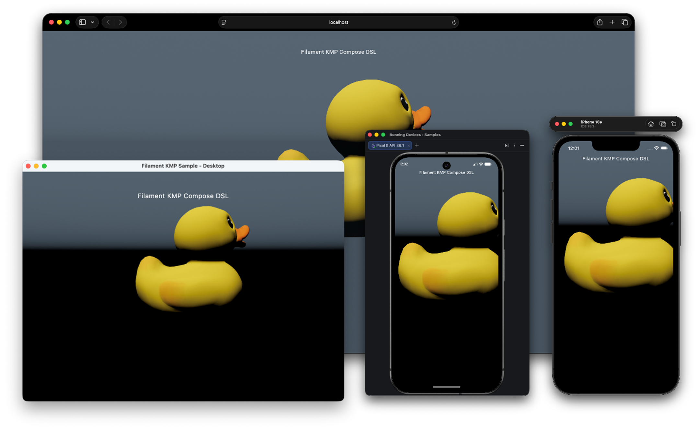

# Filament KMP

[](https://central.sonatype.com/namespace/io.github.erkko68.filament)
[](LICENSE)
[](https://github.com/google/filament)
[](https://kotlinlang.org/docs/multiplatform.html)
[](https://www.jetbrains.com/lp/compose-multiplatform/)

[](https://github.com/Erkko68/filament-kmp/actions/workflows/status-jvm.yml)
[](https://github.com/Erkko68/filament-kmp/actions/workflows/status-js.yml)
[](https://github.com/Erkko68/filament-kmp/actions/workflows/status-wasm.yml)
[](https://github.com/Erkko68/filament-kmp/actions/workflows/status-ios.yml)
[](https://github.com/Erkko68/filament-kmp/actions/workflows/status-android.yml)

> [!NOTE]
> **Unofficial project.** This is a community-maintained Kotlin Multiplatform wrapper around [Google's Filament](https://github.com/google/filament). It is not affiliated with, endorsed by, or supported by Google or the Filament team.

> [!NOTE]
> **Current release: `0.3.1`.** Major development and internal repository restructuring are done and the project is stabilizing, but public APIs may still change between minor releases while we track upstream Filament — read the [changelog](CHANGELOG.md) before upgrading. See [Versioning & stability](#versioning--stability). The JVM bindings run on Project Panama (FFM, **requires JDK 22+**).

**Filament KMP** brings the same physically based renderer that powers Android's Filament to **iOS**, **Desktop/JVM**, and **Web (JS & Wasm)**, with first-class **Compose Multiplatform** integration.



```kotlin
FilamentSceneView(
    modifier       = Modifier.fillMaxSize(),
    cameraState    = rememberCameraState(initialEye = Position(0f, 1f, 4f)),
    skyboxState    = rememberSkyboxState(SkyboxSource.Color(Color(0.1f, 0.12f, 0.15f))),
    postProcessing = PostProcessing(bloom = Bloom(strength = 0.2f)),
) {
    DirectionalLight(direction = Direction(0.3f, -1f, -0.5f), intensity = LightIntensity.LuminousPower(100_000f))
    GltfInstance(asset = rememberGltfAsset { Res.readBytes("files/Duck.glb") })
}
```

The world is declared in the content lambda; the viewport's look is configured by value. Need several cameras over one world? Hoist the scene with `rememberFilamentScene { … }` and feed it to multiple `FilamentView`s.

## Platform support

- **Android** — OpenGL ES / Vulkan via the official `com.google.android.filament` library
- **iOS** — Metal via C wrapper + Kotlin/Native cinterop
- **Desktop / JVM** (macOS, Windows, Linux) — Metal / Vulkan / OpenGL via Project Panama (FFM) bindings over a combined C wrapper
- **Web (JS & Wasm)** — WebGL 2.0 via Filament.js (embind), through hand-maintained Kotlin externals shared by the `js` and `wasmJs` targets

**JVM requirements:** the Android artifacts ship JVM 11 bytecode (minSdk 24) and work with the standard Android `jvmTarget = 11` setup. The Desktop/JVM artifacts require **JDK 22+** at build and run time — the FFM bindings call `java.lang.foreign`, finalized in JDK 22.

## Quick start

Add the Maven Central repository and depend on the modules you need:

```kotlin
// settings.gradle.kts
dependencyResolutionManagement {
    repositories {
        mavenCentral()
        google()
    }
}
```

```kotlin
// build.gradle.kts
kotlin {
    sourceSets {
        commonMain.dependencies {
            implementation("io.github.erkko68.filament:filament-compose:0.3.1")
        }
    }
}
```

For the full setup (Compose Multiplatform plugin, FFM native runtime for Desktop, iOS framework linking, Web prebuilts) see **[Getting Started](docs/getting-started.md)**.

## Modules

| Artifact | Description |
| :--- | :--- |
| `filament` | Core renderer — `Engine`, `Scene`, `View`, `Renderer`, `Camera`, `Texture`, `Material`. |
| `filament-compose` | Compose Multiplatform integration — `rememberFilamentScene` / `FilamentView` (and the `FilamentSceneView` shortcut), scene DSL, camera state, value-based post-processing. |
| `gltfio` | glTF / GLB asset loading — `AssetLoader`, `FilamentAsset`, `Animator`. |
| `filamat` | Runtime material compilation — `MaterialBuilder`. |
| `filament-utils` | Camera manipulators, HDR/KTX loaders, math helpers. |

All published under `io.github.erkko68.filament`. The Desktop/JVM bindings (Project Panama / FFM) ship as `io.github.erkko68.filament-ffm:filament-ffm` and are pulled in automatically, with the natives in per-platform `filament-ffm-runtime-<os>-<arch>` jars — all of them by default, or only your platform's if your build declares os/arch attributes (see [java/README.md](java/README.md)). See **[Modules](docs/modules.md)** for full coordinates and dependency graph.

## Versioning & stability

Releases are plain `X.Y.Z` (no pre-release suffixes since `0.2.0`):

- **`X.Y.0` (minor)** — the normal release channel. Each new upstream **Filament feature release** (1.73 → 1.74 → …) ships as a minor bump, together with any wrapper API additions or changes accumulated since the last one. This is where regular work lands; breaking wrapper API changes may appear here and are always listed in the [changelog](CHANGELOG.md).
- **`X.Y.Z` (patch)** — bug fixes only: upstream Filament point releases (e.g. 1.73.1) and fixes in the wrapper itself. Safe to pick up without reading anything.
- **`X.0.0` (major)** — reserved for maturity milestones and very large changes (a stabilized public API, a full architectural rework). Routine upstream tracking never triggers a major bump — expect minor releases to keep flowing for as long as Filament keeps releasing.

All `io.github.erkko68.filament:*` artifacts share one version and must be upgraded together. The project is actively maintained long-term and tracks upstream Filament releases as they are published (see [docs/upgrading-filament.md](docs/upgrading-filament.md) for the process). Larger technical direction — like zero-copy GPU sharing with Compose — lives in the [Roadmap](ROADMAP.md).

## API strategy

The public API stays as close as possible to the **Android Filament API**, so existing Filament knowledge transfers directly. Differences:

- **Kotlin properties** instead of `get*()` / `set*()` for single-value state accessors (e.g. `view.scene`, `camera.focusDistance`, `engine.backend`, `engine.paused`, `engine.config`). The boundary is deliberate: manager *lookups* that read as factory-ish accessors stay methods to match the Android Filament API — `engine.getTransformManager()`, `getLightManager()`, `getRenderableManager()`, `getEntityManager()` — as do calls that perform work or take arguments (`engine.getFeatureFlag(name)`, `engine.setActiveFeatureLevel(level)`).
- **Removed** APIs that are deprecated upstream or strictly Android-only (require `Context` or Android UI classes).
- **Compose DSL** layered on top — fully optional; the raw `Engine` and friends remain accessible via `FilamentEffect`.

## Documentation

### This project
- **[API Reference](https://erkko68.github.io/filament-kmp/api/)** — generated KDoc for all published modules.
- **[Getting Started](docs/getting-started.md)** — per-platform Gradle setup, first scene.
- **[Modules](docs/modules.md)** — published artifacts, dependency graph, when you need what.
- **[Platform Notes](docs/platform-notes.md)** — backends, gotchas (Windows JVM shutdown, web limits, iOS embedding).
- **[Compose Integration](docs/compose/README.md)** — scene-vs-view model, `FilamentSceneView` / `rememberFilamentScene` / `FilamentView`, scene DSL, post-processing.
- **[Repository Structure](docs/repo-structure.md)** — for contributors.

### Upstream Filament (authoritative for engine concepts)
- **[Filament Engine](https://google.github.io/filament/Filament.md.html)** — PBR theory, scene graph, lighting model, render pipeline.
- **[Materials](https://google.github.io/filament/Materials.md.html)** — material system, surface shading model, `matc` reference.

## Samples

The [`samples/`](samples/) directory contains a shared Compose scene running on all four targets. See [`samples/README.md`](samples/README.md) for build commands.

The web build is also deployed live to **[erkko68.github.io/filament-kmp](https://erkko68.github.io/filament-kmp/)** — open it on any WebGL 2.0–capable browser to try every scene without a local toolchain.

## Showcase

- **[HexonKMP](https://github.com/Erkko68/HexonKMP)** — a larger sample app: a Catan-like strategy board game built with Filament KMP, running across platforms from a single codebase. Try the live web demo at **[hexon.biri.es](https://hexon.biri.es)**.

## License

Licensed under the [Apache License, Version 2.0](LICENSE). Filament itself is also Apache-2.0 licensed by Google.
