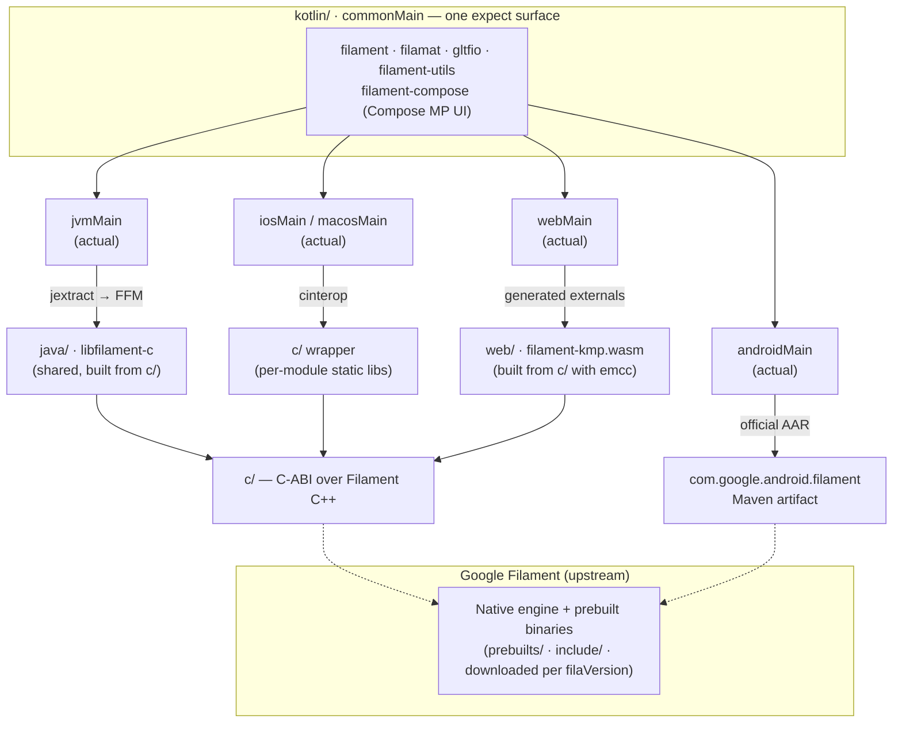

# Repository Structure

The `filament-kmp` project is organized into several modules to handle the cross-platform nature of the Filament engine.

## Architecture at a glance

One shared `expect` surface in `commonMain` fans out into four platform `actual`
implementations, each bound to the native engine by a different mechanism. Everything above
the dashed line is Kotlin we maintain; everything below is the upstream Google Filament engine.

See [Binding Strategy by Platform](#binding-strategy-by-platform) below for the same mapping
in table form.

## Core Modules

- **`c/`**: C++ wrapper that exposes a C-compatible ABI around the official Filament C++ API. Consumed three ways: **Kotlin Native** targets (iOS, macOS) via `cinterop` (one CMake library per sub-module — `libfilament-c.a`, `libfilamat-c.a`, `libfilament-utils-c.a`, `libgltfio-c.a`), the **JVM/Desktop** target via `jextract` (the `FILAMENT_BUILD_SHARED` path links all four into one `libfilament-c` shared image), and the **Web** targets via Emscripten (`FILAMENT_PLATFORM=wasm` links `filament-kmp.wasm` and a separate `filamat-kmp.wasm`). Each module's C-ABI types live in its own `*Types.h` header (core types in `filament/c/FilaTypes.h`).

- **`java/`**: The single Project Panama (FFM) JVM binding module used by the **JVM/Desktop** target only. It drives the combined `libfilament-c` shared build via CMake, runs `jextract` over the C headers to generate the low-level bindings, bundles the native image as a JAR resource, and loads it at runtime. **Android does not use this folder** — it depends on the official `com.google.android.filament` Maven packages instead. See [`java/README.md`](../java/README.md).

- **`web/`**: The web counterpart of `java/`, used by the **Web** targets (`js` + `wasmJs`). It builds `c/` with Emscripten into `filament-kmp.{js,wasm}` (+ `filamat-kmp.{js,wasm}`), generates Kotlin externals for every exported `Fila*` function from the C headers, and holds the small runtime (heap access, strings, callbacks, WebGL context). See [`web/README.md`](../web/README.md).

- **`kotlin/`**: The core Kotlin Multiplatform wrapper. Contains five modules:
    - `filament` — Core engine components (Engine, Scene, View, Renderer, …).
    - `filamat` — Material compilation (MaterialBuilder).
    - `gltfio` — glTF asset loading (AssetLoader, FilamentAsset, Animator, …).
    - `filament-utils` — Math utilities, camera manipulators, HDR/KTX loaders.
    - `filament-compose` — Compose Multiplatform UI integration layer (see [Compose docs](compose/README.md)).

- **`prebuilts/`**: Prebuilt Filament static libraries for platforms that do not have an official Maven package: `iosArm64`, `iosSimulatorArm64`, `iosX64`, `macosArm64`, and the desktop hosts. Downloaded by the `downloadPrebuilts` Gradle task (pure-JVM, see `build-logic/src/main/kotlin/FilamentDownloads.kt`). The matching public headers land in `include/` via the `downloadIncludes` task. Upstream publishes no wasm libraries, so `prebuilts/wasm/` is built locally by `scripts/dev/build-wasm-libs.sh`.

- **`samples/`**: Multiplatform example applications for Android, iOS, Desktop (JVM), and Web.

## Binding Strategy by Platform

| Platform | Filament binding | Source |
| :--- | :--- | :--- |
| **Android** | Official Maven library | `com.google.android.filament:filament-android` |
| **JVM / Desktop** | Project Panama (FFM) over the C wrapper | `java/` module + `c/` wrapper |
| **iOS / macOS** | C-interop (Kotlin Native) | `c/` wrapper + `prebuilts/` |
| **Web / WASM** | Generated externals over our own wasm | `web/` module + `c/` wrapper + `prebuilts/wasm/` |

## Build System

The project uses **Gradle (Kotlin DSL)** for dependency management and build orchestration.

- **Android** delegates entirely to the official Filament Gradle plugin / Maven artifact.
- **JVM** builds invoke **CMake** from the `:java` module build script to compile the combined `libfilament-c` shared image, then run **`jextract`** over the C headers to generate the FFM bindings.
- **Native (iOS / macOS)** builds invoke **CMake** from the `:kotlin:*` module build scripts to compile the C wrapper, then run `cinterop` to generate Kotlin bindings.
- **Web** builds the `c/` wrapper with Emscripten from the `:web` module (`buildFilamentWasm`), linking the wasm Filament libraries in `prebuilts/wasm/`, and generates the externals from the C headers (see [`web/README.md`](../web/README.md)).
