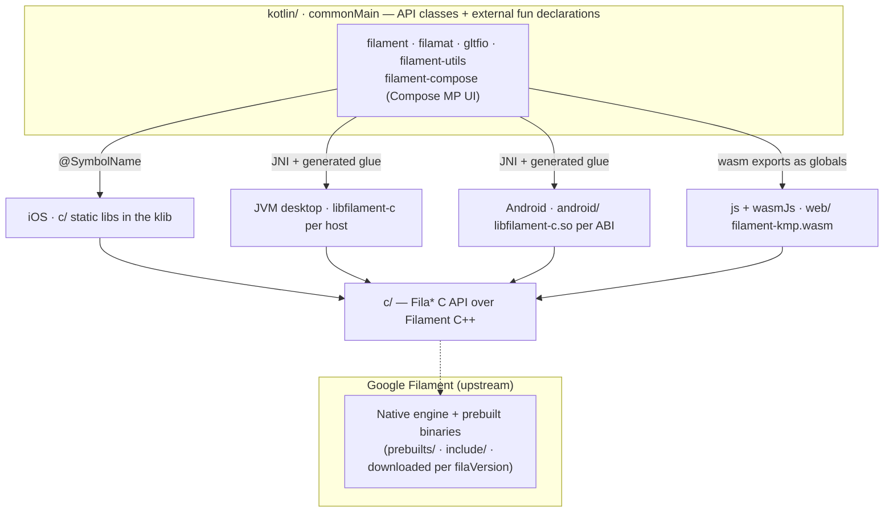

# Repository Structure

The `filament-kmp` project is organized into several modules to handle the cross-platform nature of the Filament engine.

## Architecture at a glance

The API is written once in `commonMain`: each class holds a native pointer and calls our C API
(`c/`) through `external fun`s declared next to it, the model skiko uses for Skia. Only the way an
`external fun` reaches its C symbol differs per platform, and none of that is hand-written. See
[Native Bindings](bindings.md) for the details and the rules for adding one.

```mermaid
flowchart TB
    subgraph common["kotlin/ · commonMain — API classes + external fun declarations"]
        API["filament · filamat · gltfio · filament-utils<br/>filament-compose (Compose MP UI)"]
    end

    API -->|"@SymbolName"| NAT["iOS · c/ static libs in the klib"]
    API -->|"JNI + generated glue"| JVM["JVM desktop · libfilament-c per host"]
    API -->|"JNI + generated glue"| AND["Android · android/ libfilament-c.so per ABI"]
    API -->|"wasm exports as globals"| WEB["js + wasmJs · web/ filament-kmp.wasm"]

    NAT --> CWRAP["c/ — Fila* C API over Filament C++"]
    JVM --> CWRAP
    AND --> CWRAP
    WEB --> CWRAP

    CWRAP -.-> ENGINE

    subgraph upstream["Google Filament (upstream)"]
        ENGINE["Native engine + prebuilt binaries<br/>(prebuilts/ · include/ · downloaded per filaVersion)"]
    end
```

> [!NOTE]
> Migration in progress: classes are moving from per-platform `actual`s to `commonMain` one at a
> time, and the JVM still runs the rest on Project Panama (`java/`). See
> [Migration status](bindings.md#migration-status).

## Core Modules

- **`c/`**: C++ wrapper that exposes a C-compatible ABI (the `Fila*` functions) around the official Filament C++ API; every platform binds it. One CMake project builds it per target: static libraries for **Kotlin/Native** (one per sub-module — `libfilament-c.a`, `libfilamat-c.a`, `libfilament-utils-c.a`, `libgltfio-c.a`), one shared `libfilament-c` for the **JVM desktop** (`FILAMENT_BUILD_SHARED`, with the JNI glue compiled in), one `libfilament-c.so` per ABI for **Android** (`FILAMENT_PLATFORM=android`), and `filament-kmp.wasm` + `filamat-kmp.wasm` for **web** (`FILAMENT_PLATFORM=wasm`). Each module's C-ABI types live in its own `*Types.h` header (core types in `filament/c/FilaTypes.h`).

- **`jni/`**: The JNI runtime shared by JVM desktop and Android: native memory and callbacks (`FilaJni`), the desktop library loader (`FilamentLoader`), and `generateJniGlue`, which writes the JNI forwarders for the common `external fun`s. See [`jni/README.md`](../jni/README.md).

- **`android/`**: The Android runtime: builds `c/` plus the JNI glue with the NDK into `libfilament-c.so` per ABI over upstream's `android-native` prebuilts. See [`android/README.md`](../android/README.md).

- **`web/`**: The web runtime (`js` + `wasmJs`): builds `c/` with Emscripten into `filament-kmp.{js,wasm}` (+ `filamat-kmp.{js,wasm}`), loads it and installs its exports as the globals the common `external fun`s bind to, and holds the heap/callback/WebGL helpers. See [`web/README.md`](../web/README.md).

- **`java/`** *(being removed)*: The Project Panama (FFM) module the JVM target used before the move to JNI. It drives the desktop `libfilament-c` CMake build and runs `jextract` for the classes not yet in `commonMain`. See [`java/README.md`](../java/README.md).

- **`kotlin/`**: The core Kotlin Multiplatform wrapper. API classes and their `external fun` declarations live in each module's `commonMain`; the small per-platform interop runtime (`NativePointer`, `InteropScope`) is in `kotlin/filament`'s `interop/` package. Contains five modules:
    - `filament` — Core engine components (Engine, Scene, View, Renderer, …).
    - `filamat` — Material compilation (MaterialBuilder).
    - `gltfio` — glTF asset loading (AssetLoader, FilamentAsset, Animator, …).
    - `filament-utils` — Math utilities, camera manipulators, HDR/KTX loaders.
    - `filament-compose` — Compose Multiplatform UI integration layer (see [Compose docs](compose/README.md)).

- **`prebuilts/`**: Prebuilt Filament static libraries from the upstream GitHub release: `iosArm64`, `iosSimulatorArm64`, `iosX64`, `macosArm64`, the desktop hosts, and `android-<abi>`. Downloaded by the `downloadPrebuilts` Gradle task (pure-JVM, see `build-logic/src/main/kotlin/FilamentDownloads.kt`). The matching public headers land in `include/` via the `downloadIncludes` task. Upstream publishes no wasm libraries, so `prebuilts/wasm/` is built locally by `scripts/dev/build-wasm-libs.sh`.

- **`samples/`**: Multiplatform example applications for Android, iOS, Desktop (JVM), and Web.

## Binding Strategy by Platform

| Platform | How a common `external fun` binds | Native library | Source |
| :--- | :--- | :--- | :--- |
| **Android** | JNI, forwarders generated from the Kotlin declarations | `libfilament-c.so` per ABI | `android/` + `jni/` + `c/` + `prebuilts/android-*` |
| **JVM / Desktop** | JNI, same forwarders (Panama/FFM for classes not yet migrated) | `libfilament-c` per host | `java/` (CMake) + `jni/` + `c/` |
| **iOS** | `@SymbolName`, a direct call to the C symbol | `c/` static libs in the klib | `c/` + `prebuilts/` |
| **Web / WASM** | by name, against the wasm exports installed as globals | `filament-kmp.wasm` | `web/` + `c/` + `prebuilts/wasm/` |

## Build System

The project uses **Gradle (Kotlin DSL)** for dependency management and build orchestration; the convention plugins and build tasks live in `build-logic/`.

- **Android** builds the `c/` wrapper plus the JNI runtime and glue with the NDK from the `:android` module (`buildJniLibs`), one `libfilament-c.so` per ABI (see [`android/README.md`](../android/README.md)).
- **JVM** builds the desktop `libfilament-c` with **CMake** from the `:java` module (JNI runtime and glue included), then runs `jextract` for the classes still on FFM.
- **Native (iOS)** builds invoke **CMake** from the `:kotlin:*` module build scripts to compile the C wrapper; `cinterop` packs the static libraries into the klib.
- **Web** builds the `c/` wrapper with Emscripten from the `:web` module (`buildFilamentWasm`), linking the wasm Filament libraries in `prebuilts/wasm/` (see [`web/README.md`](../web/README.md)).
- **JNI glue**: `:jni:generateJniGlue` writes the forwarders from the common `external fun` declarations; the Android and desktop builds depend on it.
